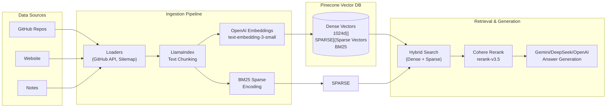

# RAG Server

[]()
[](https://www.python.org/)
[](https://fastapi.tiangolo.com/)
[](https://www.pinecone.io/)
[](https://python.langchain.com/)
[](https://www.llamaindex.ai/)
[](https://pytest.org/)

A FastAPI-based Retrieval-Augmented Generation (RAG) server with **hybrid search** (dense + sparse vectors), **incremental ingestion**, and **multi-source data loaders**.

## Architecture Overview



## Technology Stack

### Core Framework
- **FastAPI** - Modern async web framework
- **LlamaIndex** - Document chunking and processing
- **LangChain** - LLM integration and orchestration

### Vector Database & Search
- **Pinecone** - Managed vector database with hybrid search
  - Dense vectors: OpenAI `text-embedding-3-small` (1024d)
  - Sparse vectors: BM25 encoding for keyword search

### LLM & Embeddings
- **OpenAI** - `text-embedding-3-small` for embeddings, `gpt-4o` for generation
- **Cohere** - `rerank-v3.5` for result reranking
- **Google Gemini** - Answer generation
- **DeepSeek** - Alternative LLM provider

### Data Loaders
- **LlamaIndex** - Document chunking and processing
- **GitHub API** - Repository metadata, README, dependency files
- **Website Crawler** - Sitemap-based page ingestion

### Development & CI/CD
- **Pre-commit** - Black, isort, flake8, pytest for changed files
- **GitHub Actions** - PR checks for format, lint, and tests
- **pytest** - Async test support with mocking

## Key Improvements

### 1. Smart Ingestion (Incremental Updates)

**Problem:** Re-indexing would delete entire namespaces and re-process all documents, wasting API calls and time.

**Solution:** Implemented content hash tracking for incremental updates:

```python
# Deterministic document ID
# Each document gets a unique, deterministic ID based on source + path
doc_id = compute_doc_id("github_repos", "my-repo")

# Content hash tracking
# Only changed documents trigger re-embedding
if old_hash == new_hash:
    skip_unchanged()  # No API call needed
else:
    update_document()  # Only update changed docs
```

**Benefits:**
- 90%+ reduction in embedding API calls for unchanged content
- Granular deletion - remove single documents without clearing namespace
- Traceable metadata: `doc_id`, `doc_hash`, `chunk_hash`, `last_updated`

### 2. Hybrid Search (Dense + Sparse)

**Problem:** Pure semantic search misses exact keyword matches; pure keyword search misses semantic meaning.

**Solution:** Combined dense + sparse vectors in Pinecone:

```python
# Dense vector from OpenAI embeddings
embedding = embed_text(chunk)

# Sparse vector from BM25 keyword encoding  
sparse_vector = bm25_encoder.encode_queries(chunk)

# Hybrid search combines both
results = index.query(
    vector=embedding,
    sparse_vector=sparse_vector,
    top_k=10
)
```

**Benefits:**
- Captures semantic similarity AND exact keyword matches
- Better retrieval for technical terms, package names, version numbers

### 3. Improved Document Tracking

**Deterministic IDs:**
```python
# Normal: random UUIDs
"id": "550e8400-e29b-41d4-a716-446655440000"

# Improved: deterministic from source + path
"id": "a3f9b2c1d8e7_0"  # hash("github_repos:my-repo") + chunk_index
```

**Metadata Enrichment:**
```json
{
  "doc_id": "a3f9b2c1d8e7",
  "doc_hash": "sha256:abc123...",
  "chunk_hash": "sha256:def456...",
  "chunk_index": 0,
  "total_chunks": 5,
  "source": "github_repos",
  "repo": "my-project",
  "last_updated": "2024-01-15T10:30:00Z"
}
```

### 4. Granular Document Operations

**Delete by Document ID:**
```python
# Normal: clear entire namespace
clear_namespace("github_repos")  # Deletes everything!

# Improved: delete single document
delete_document("a3f9b2c1d8e7", "github_repos")  # Only that repo
```

**Query Document Chunks:**
```python
# Get all chunks belonging to a specific document
chunks = await get_document_chunks(doc_id, namespace)
```

### 5. Markdown Blog Post Optimization

Special handling for markdown blog posts:

**Frontmatter Parsing:**
- Extracts YAML metadata
- Supports Obsidian-style frontmatter format

**Semantic Header-Based Chunking:**
- Splits by Markdown headers (`#`, `##`, `###`) instead of fixed size
- Preserves document structure and context
- Merges small sections, splits large ones at paragraph boundaries

**Context Enrichment for Embeddings:**
```
Document: My Blog Title
Section: Technical > Python
Subsection: Async Programming

[actual content...]
```

## Project Structure

```
rag-server/
├── app/
│   ├── api/
│   │   ├── routes.py            # REST endpoints
│   │   └── webhooks.py          # GitHub webhook handler
│   ├── core/
│   │   ├── config.py            # Pydantic settings
│   │   └── events.py            # FastAPI lifespan (startup/shutdown)
│   ├── db/
│   │   └── pinecone.py          # Pinecone client & BM25 encoder
│   ├── loaders/
│   │   ├── github_loader.py     # GitHub repos + dependency parsing
│   │   └── website_loader.py    # Website sitemap crawler
│   ├── indexers/
│   │   └── vector_indexer.py    # Chunking, embedding, upsert logic
│   ├── services/
│   │   ├── answer_generator.py  # LLM answer generation (Google/OpenAI/DeepSeek)
│   │   ├── chunker.py           # Simple text chunking
│   │   ├── embedding.py         # OpenAI embeddings
│   │   ├── frontmatter_parser.py# Markdown frontmatter extraction
│   │   ├── ingestion.py         # Smart upsert/delete
│   │   ├── markdown_chunker.py # Markdown-aware chunking
│   │   └── retriever.py         # Hybrid search + reranking
│   ├── utils/
│   └── main.py                  # FastAPI app factory
├── tests/
│   ├── test_vector_indexer.py   # Hash, doc_id, upsert tests
│   ├── test_ingestion.py        # Ingestion service tests
│   ├── test_github_loader.py    # Dependency parser tests
│   ├── test_sync_jobs.py        # Sync job tests
│   └── test_api.py              # API endpoint tests
├── scripts/
│   └── run_changed_tests.py     # Pre-commit test runner
├── .github/workflows/ci.yml     # PR checks (format, lint, test)
└── .pre-commit-config.yaml      # Local pre-commit hooks
```

## API Endpoints

| Method | Endpoint | Description |
|--------|----------|-------------|
| GET | `/` | Health check |
| GET | `/api/query?q={question}` | Query RAG system |
| POST | `/api/ingest/website` | Sync website content |
| POST | `/api/ingest/github-all-repos` | Sync all GitHub repos |
| POST | `/api/ingest/notes` | Sync notes repo (blog) manually |
| POST | `/api/webhooks/github` | GitHub push webhook |

## Setup

### 1. Clone and install

```bash
git clone https://github.com/roger-twan/rag-server.git
cd rag-server
python -m venv .venv
source .venv/bin/activate
pip install -r requirements.txt
```

### 2. Configure environment

```bash
cp .env.example .env
# Edit .env with your keys:
# - ENVIRONMENT=development
# - PINECONE_API_KEY
# - PINECONE_INDEX_HOST  
# - OPENAI_API_KEY
# - COHERE_API_KEY
# - GOOGLE_API_KEY
# - GITHUB_TOKEN (for repo loading)
# - GITHUB_WEBHOOK_SECRET
# - DEEPSEEK_API_KEY (for DeepSeek LLM)
# - PUBLIC_API_TOKEN (for /query endpoint request)
# - ADMIN_API_TOKEN (for ingest endpoints request)
```

### 3. Install pre-commit hooks

```bash
pre-commit install
```

### 4. Run server

```bash
# Development
fastapi dev app/main.py
```

## Development

### Running Tests

```bash
# All tests
pytest tests/ -v

# Specific test file
pytest tests/test_vector_indexer.py -v

# Tests for changed files only (via pre-commit)
python scripts/run_changed_tests.py
```

### Code Quality

```bash
# Format code
black .
isort .

# Lint
flake8 app tests scripts

# Run pre-commit manually
pre-commit run --all-files
```

## CI/CD Pipeline

**Pull Request Checks:**
1. **Black** - Code formatting
2. **isort** - Import sorting  
3. **flake8** - Linting
4. **pytest** - Full test suite

All checks must pass before merging to `main`.

## Change Log

### 1.1.0 (2026-04-03)
- Added API token authentication
- Added request rate limiting

## TODO
- [x] Add request rate limiting and authentication (v1.1.0)
- [ ] Support sync specific GitHub repos
- [ ] Complete sync blog by GitHub Push Webhook
- [ ] Add chat memory
- [ ] Add evaluation strategy
- [ ] Support streaming responses
